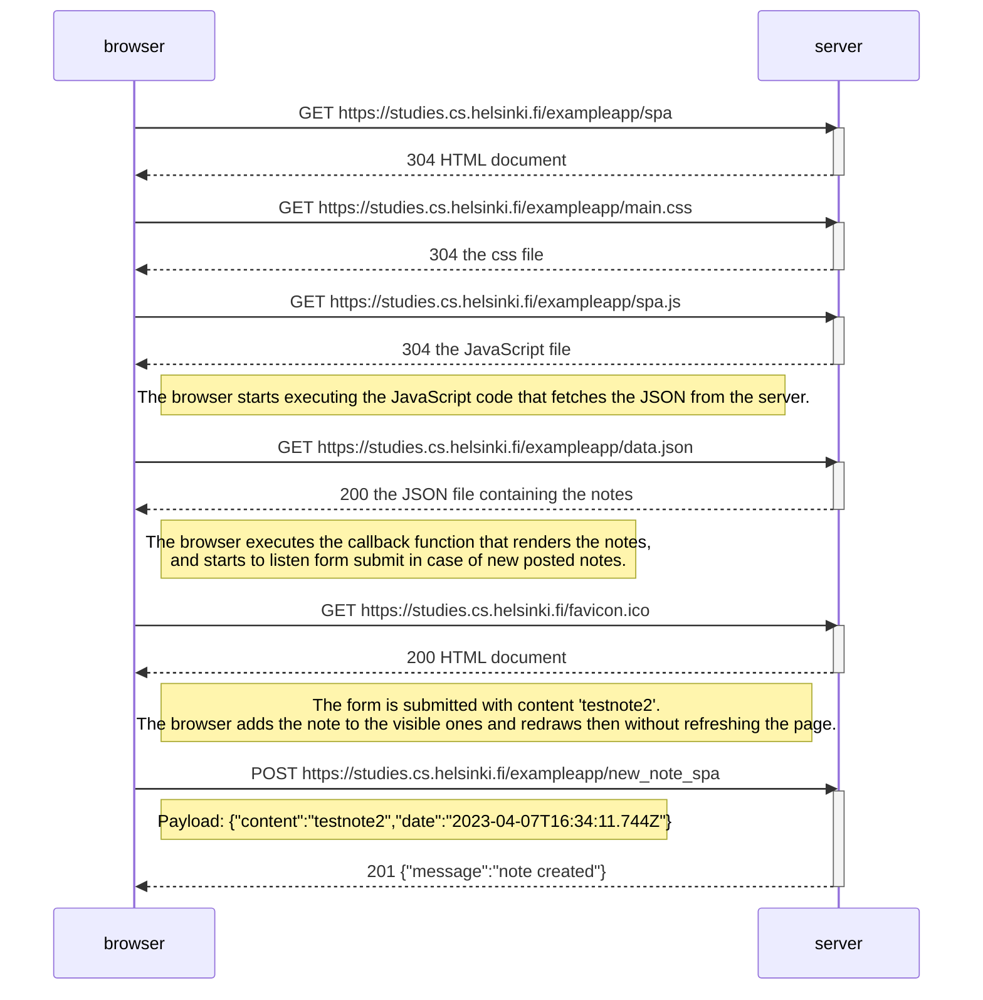

```mermaid
sequenceDiagram
    participant browser
    participant server

    browser->>server: GET https://studies.cs.helsinki.fi/exampleapp/spa
    activate server
    server-->>browser: 304 HTML document
    deactivate server

    browser->>server: GET https://studies.cs.helsinki.fi/exampleapp/main.css
    activate server
    server-->>browser: 304 the css file
    deactivate server

    browser->>server: GET https://studies.cs.helsinki.fi/exampleapp/spa.js
    activate server
    server-->>browser: 304 the JavaScript file
    deactivate server

    Note right of browser: The browser starts executing the JavaScript code that fetches the JSON from the server.

    browser->>server: GET https://studies.cs.helsinki.fi/exampleapp/data.json
    activate server
    server-->>browser: 200 the JSON file containing the notes
    deactivate server

    Note right of browser: The browser executes the callback function that renders the notes,<br/>and starts to listen form submit in case of new posted notes.
    
    browser->>server: GET https://studies.cs.helsinki.fi/favicon.ico
    activate server
    server-->>browser: 200 HTML document
    deactivate server
    
    Note right of browser: The form is submitted with content 'testnote2'.<br/> The browser adds the note to the visible ones and redraws then without refreshing the page.
    
    browser->>server: POST https://studies.cs.helsinki.fi/exampleapp/new_note_spa
    activate server
    Note right of browser: Payload: {"content":"testnote2","date":"2023-04-07T16:34:11.744Z"}
    server-->>browser: 201 {"message":"note created"}
    deactivate server
```    
